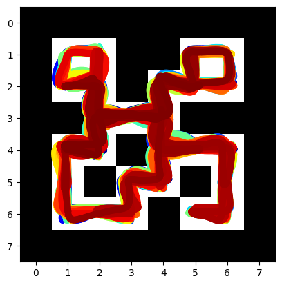
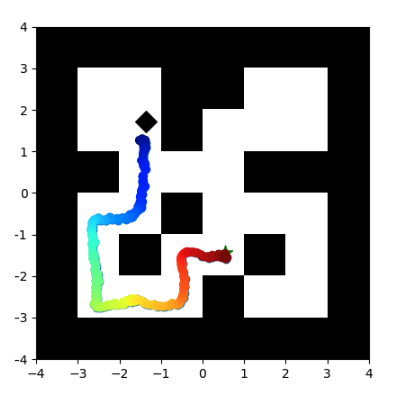
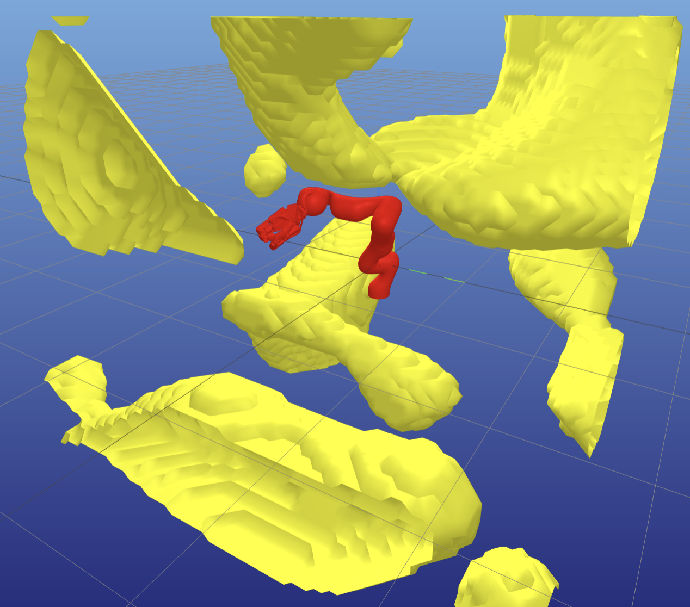
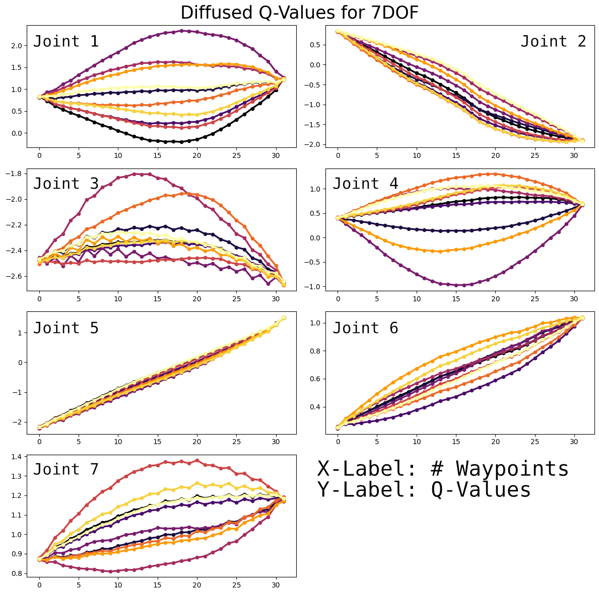

# Robotic Path Planning Using Diffusion Models

This project was conducted as part of the Advanced Deep Learning in Robotics (ADLR) course at the Learning AI for Dexterous Robots lab of Prof. Dr. Berthold Bäuml, in cooperation with the German Aerospace Center (DLR). The aim was to explore the usage of diffusion models for robotic path planning.
We reference the work of Janner et al. [Diffuser](https://github.com/jannerm/diffuser).

We explored diffusion models for path planning in 2D and 3D environments. Initially applied to the 2D Pointmaze-medium, we then extended our work to the Kuka Robot LWR3.

### 2D Pointmaze-Medium

<p align="center">
    
    
</p>

### Kuka Robot LWR3

<p align="center">
    
    
</p>


## Getting started

To get started, follow these steps:

1. Install Poetry (only for the first execution):
    ```shell
    pip install poetry
    ```

2. Install project dependencies (only for the first execution):
    ```shell
    poetry install
    ```

3. Activate the Virtual Environment:
    ```shell
    poetry shell
    ```


4. Add Dependencies (Optional): If you need to add new dependencies to your project, you can use the following command:
    ```shell
    poetry add <package-name>
    ```

4. Update Dependencies (Optional): To update the dependencies to the latest versions according to the constraints in your pyproject.toml file, use:
    ```shell
    poetry update
    ```